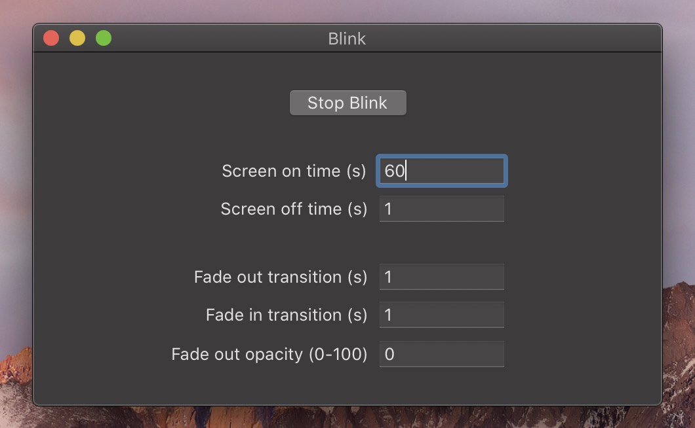

# Blink

A Mac OS X application to encourage blinking by fading the screen to black at configurable intervals.

  

## Download

Head to the [releases page](https://github.com/freedmand/blink/releases) to download the latest version.

To get it running:

- unzip the application bundle
- drag the application into the Applications folder
- right-click the application, click "Open", and then hit "Open" again (you only have to open it like this the first time due to Mac's security policy)

## Parameters

All parameters are time values specified in seconds, with the exception of the last parameter ("Fade out opacity").

| Parameter           | Description                                                                        | Blink metaphor                               | Default |
| ------------------- | ---------------------------------------------------------------------------------- | -------------------------------------------- | ------- |
| Screen on time      | How long the screen should be on between fades                                     | How long the eyes are open in between blinks | `60`    |
| Screen off time     | How long the screen should be black after fading out and before fading in          | How long the eyes are closed while blinking  | `1`     |
| Fade out transition | How long the screen should take to fade to black                                   | How long the eyelids take to close           | `2`     |
| Fade in transition  | How long the screen should take to fade back in                                    | How long the eyelids take to open            | `1`     |
| Fade out opacity    | How black the screen should fade (0 is pitch black, 100 is as if nothing happened) | How far the eyelids close (0 is closed)      | `0`     |

## Development

This application was built and developed with [Xcode](https://developer.apple.com/xcode/). To develop the application, open the `.xcodeproj` file in Xcode and use the integrated IDE to edit and run the project.

## License

MIT
